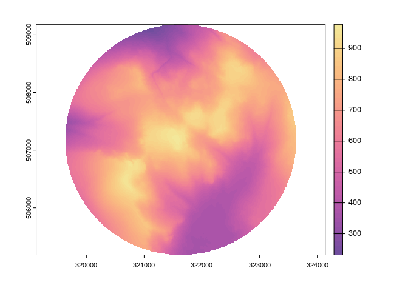

<!-- README.md is generated from README.Rmd. Please edit that file -->

# gblidar

<!-- badges: start -->

[](https://lifecycle.r-lib.org/articles/stages.html#experimental)
<!-- badges: end -->

# To Do List:

- [x] Added options for merging rasters and exporting as SpatRaster,
  stars of character.
- [x] Generic merge for all rasters in gbl_catalog.
- [ ] chunk large requested areas to prevent exceeding the EA API limit.
- [ ] chunk mulitpolygon object requests as I don’t think the EA API
  supports this.
- [ ] Add Scottish Data
- [ ] Add Welsh Data
- [ ] Write Tests

**Scottish and Welsh Data are yet to be added as the tricky thing to get
right is the English ESRI API stuff - once this is stable we can slot
the other nations in with relative ease I hope**

## Installation

You can install the development version of gblidar from
[GitHub](https://github.com/) with:

``` r
# install.packages("devtools")
devtools::install_github("h-a-graham/gblidar")
```

## Example

This is a super quick demo

``` r
library(gblidar)
library(sf)
#> Linking to GEOS 3.11.1, GDAL 3.6.2, PROJ 9.1.1; sf_use_s2() is TRUE
if (rlang::is_installed("terra")){
  library(terra)
  options(gblidar.out_raster_type = "SpatRaster")
}
#> terra 1.7.3

scafell_box <- st_point(c(321633 , 507181))  |>
  st_buffer(2000)  |>
  st_sfc() |>
  st_set_crs(27700)

scafell_catalog <- eng_search(scafell_box)
#> ℹ ESRI REST API request status: "esriJobSucceeded"

print(scafell_catalog)
#> Data Catalog
#> # A tibble: 34 × 4
#>    product                                   resolution  year urls      
#>    <chr>                                          <dbl> <int> <list>    
#>  1 LIDAR Composite DTM                                1  2020 <chr [12]>
#>  2 LIDAR Composite DTM                                1  2022 <chr [12]>
#>  3 LIDAR Composite DTM                                2  2020 <chr [12]>
#>  4 LIDAR Composite DTM                                2  2022 <chr [12]>
#>  5 LIDAR Composite First Return DSM                   1  2020 <chr [12]>
#>  6 LIDAR Composite First Return DSM                   1  2022 <chr [12]>
#>  7 LIDAR Composite First Return DSM                   2  2020 <chr [12]>
#>  8 LIDAR Composite First Return DSM                   2  2022 <chr [12]>
#>  9 LIDAR Composite Last Return DSM                    1  2020 <chr [12]>
#> 10 LIDAR Composite Last Return DSM                    1  2022 <chr [12]>
#> 11 LIDAR Composite Last Return DSM                    2  2020 <chr [12]>
#> 12 LIDAR Composite Last Return DSM                    2  2022 <chr [12]>
#> 13 LIDAR Point Cloud                                 NA  2008 <chr [3]> 
#> 14 LIDAR Point Cloud                                 NA  2009 <chr [9]> 
#> 15 LIDAR Tiles DSM                                    1  2007 <chr [2]> 
#> 16 LIDAR Tiles DSM                                    1  2008 <chr [3]> 
#> 17 LIDAR Tiles DSM                                    1  2009 <chr [9]> 
#> 18 LIDAR Tiles DSM                                    2  2000 <chr [2]> 
#> 19 LIDAR Tiles DTM                                    1  2007 <chr [2]> 
#> 20 LIDAR Tiles DTM                                    1  2008 <chr [3]> 
#> 21 LIDAR Tiles DTM                                    1  2009 <chr [9]> 
#> 22 LIDAR Tiles DTM                                    2  2000 <chr [2]> 
#> 23 National LIDAR Programme DSM                       1  2019 <chr [9]> 
#> 24 National LIDAR Programme DSM                       1  2021 <chr [3]> 
#> 25 National LIDAR Programme DTM                       1  2019 <chr [9]> 
#> 26 National LIDAR Programme DTM                       1  2021 <chr [3]> 
#> 27 National LIDAR Programme First Return DSM          1  2019 <chr [9]> 
#> 28 National LIDAR Programme First Return DSM          1  2021 <chr [3]> 
#> 29 National LIDAR Programme Intensity                 1  2019 <chr [9]> 
#> 30 National LIDAR Programme Intensity                 1  2021 <chr [3]> 
#> 31 National LIDAR Programme Point Cloud               1  2019 <chr [9]> 
#> 32 National LIDAR Programme Point Cloud               1  2021 <chr [3]> 
#> 33 National LIDAR Programme VOM                       1  2019 <chr [9]> 
#> 34 National LIDAR Programme VOM                       1  2021 <chr [3]>
#> AOI Geometry
#> Geometry set for 1 feature 
#> Geometry type: POLYGON
#> Dimension:     XY
#> Bounding box:  xmin: 319633 ymin: 505181 xmax: 323633 ymax: 509181
#> Projected CRS: OSGB36 / British National Grid
#> POLYGON ((323633 507181, 323630.3 507076.3, 323...
#> Tile Names
#> [1] "NY10NE" "NY20NW"

DTM_catalog <- scafell_catalog |>
  filter_catalog(product == "LIDAR Composite DTM",
                 resolution == 2,
                 year == 2022)

print(DTM_catalog)
#> Data Catalog
#> # A tibble: 1 × 4
#>   product             resolution  year urls      
#>   <chr>                    <dbl> <int> <list>    
#> 1 LIDAR Composite DTM          2  2022 <chr [12]>
#> AOI Geometry
#> Geometry set for 1 feature 
#> Geometry type: POLYGON
#> Dimension:     XY
#> Bounding box:  xmin: 319633 ymin: 505181 xmax: 323633 ymax: 509181
#> Projected CRS: OSGB36 / British National Grid
#> POLYGON ((323633 507181, 323630.3 507076.3, 323...
#> Tile Names
#> [1] "NY10NE" "NY20NW"

scafell_raster <- merge_assets(DTM_catalog, mask=TRUE)

plot(scafell_raster, col=grDevices::hcl.colors(50, palette = "Sunset"))
```



…
