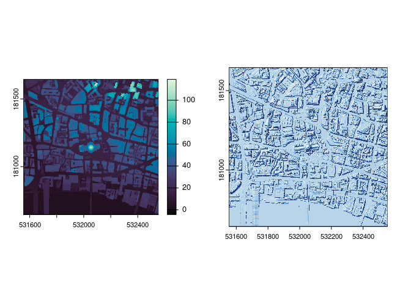

<!-- README.md is generated from README.Rmd. Please edit that file -->

# gblidar

<!-- badges: start -->

[](https://lifecycle.r-lib.org/articles/stages.html#experimental)
<!-- badges: end -->

gblidar aims to make accessing LiDAR data from across Great Britain as
easy as possible. It provides functions to search the Environment
Agency’s LiDAR catalogue, download composite products, and merge the
data into a single raster. It also provides functions to access the data
from the EA’s WCS services, which is significantly faster but only
available for some composite products. This package is still in
development and only supports English data for now but will be expanded
to include Scotland and Wales in the future.

# To Do List:

  - [x] Added options for merging rasters and exporting as SpatRaster,
    stars of character.
  - [x] Generic merge for all rasters in gbl\_catalog.
  - [x] Add special functions for hitting the WCS data to get faster
    access to large composite areas.
  - [ ] Add Scottish Data
  - [ ] Add Welsh Data
  - [ ] Write Tests

## Installation

You can install the development version of gblidar from
[GitHub](https://github.com/) with:

``` r
# install.packages("pak")
pak::pkg_install("h-a-graham/gblidar")
```

## Example

This is a super quick demo where we can query the Environment Agency’s
entire LIDAR catalogue using the `eng_search` function. This will return
a `gbl_catalog` object which can be used to filter the assets and then
merge them into a single raster. In this example we search the area
around Scafell Pike, use the `filter_catalog` function to reduce the
number of assets to just the 2m DTM composite for 2022, and then use the
`merge_assets` function to merge all the assets into a single raster. By
default the raster is saved to disk and the  
file path is returned, but this can be changed using `raster_class`
argument in `merge_assets` to return a `stars` or `SpatRaster` object
(or you can alternatively set the global option
`gblidar.out_raster_type` to “stars” or “SpatRaster” as in the example
below).

``` r
library(gblidar)
library(sf)
#> Linking to GEOS 3.12.1, GDAL 3.8.3, PROJ 9.3.1; sf_use_s2() is TRUE
if (rlang::is_installed("terra")) {
  library(terra)
  options(gblidar.out_raster_type = "SpatRaster")
}
#> terra 1.7.71

scafell_box <- st_point(c(321633, 507181)) |>
  st_buffer(2000) |>
  st_sfc() |>
  st_set_crs(27700)

scafell_catalog <- eng_search(scafell_box)

print(scafell_catalog)
#> Data Catalog
#> # A tibble: 28 × 5
#>    product                                   resolution  year filenames urls  
#>    <chr>                                          <dbl> <int> <list>    <list>
#>  1 LIDAR Composite DTM                                1  2022 <chr [9]> <chr> 
#>  2 LIDAR Composite DTM                                2  2022 <chr [9]> <chr> 
#>  3 LIDAR Composite First Return DSM                   1  2022 <chr [9]> <chr> 
#>  4 LIDAR Composite First Return DSM                   2  2022 <chr [9]> <chr> 
#>  5 LIDAR Composite Last Return DSM                    1  2022 <chr [9]> <chr> 
#>  6 LIDAR Composite Last Return DSM                    2  2022 <chr [9]> <chr> 
#>  7 LIDAR Point Cloud                                 NA  2008 <chr [1]> <chr> 
#>  8 LIDAR Point Cloud                                 NA  2009 <chr [8]> <chr> 
#>  9 LIDAR Tiles DSM                                    1  2007 <chr [2]> <chr> 
#> 10 LIDAR Tiles DSM                                    1  2008 <chr [3]> <chr> 
#> 11 LIDAR Tiles DSM                                    1  2009 <chr [8]> <chr> 
#> 12 LIDAR Tiles DSM                                    2  2000 <chr [2]> <chr> 
#> 13 LIDAR Tiles DTM                                    1  2007 <chr [2]> <chr> 
#> 14 LIDAR Tiles DTM                                    1  2008 <chr [3]> <chr> 
#> 15 LIDAR Tiles DTM                                    1  2009 <chr [8]> <chr> 
#> 16 LIDAR Tiles DTM                                    2  2000 <chr [2]> <chr> 
#> 17 National LIDAR Programme DSM                       1  2019 <chr [7]> <chr> 
#> 18 National LIDAR Programme DSM                       1  2021 <chr [2]> <chr> 
#> 19 National LIDAR Programme DTM                       1  2019 <chr [7]> <chr> 
#> 20 National LIDAR Programme DTM                       1  2021 <chr [2]> <chr> 
#> 21 National LIDAR Programme First Return DSM          1  2019 <chr [7]> <chr> 
#> 22 National LIDAR Programme First Return DSM          1  2021 <chr [2]> <chr> 
#> 23 National LIDAR Programme Intensity                 1  2019 <chr [7]> <chr> 
#> 24 National LIDAR Programme Intensity                 1  2021 <chr [2]> <chr> 
#> 25 National LIDAR Programme Point Cloud               1  2019 <chr [7]> <chr> 
#> 26 National LIDAR Programme Point Cloud               1  2021 <chr [2]> <chr> 
#> 27 National LIDAR Programme VOM                       1  2019 <chr [7]> <chr> 
#> 28 National LIDAR Programme VOM                       1  2021 <chr [2]> <chr>
#> AOI Geometry
#> Geometry set for 1 feature 
#> Geometry type: POLYGON
#> Dimension:     XY
#> Bounding box:  xmin: 319633 ymin: 505181 xmax: 323633 ymax: 509181
#> Projected CRS: OSGB36 / British National Grid
#> POLYGON ((323633 507181, 323630.3 507076.3, 323...
#> Tile Names
#> [1] "NY10NE" "NY20NW"

DTM_catalog <- scafell_catalog |>
  filter_catalog(
    product == "LIDAR Composite DTM",
    resolution == 2,
    year == 2022
  )

print(DTM_catalog)
#> Data Catalog
#> # A tibble: 1 × 5
#>   product             resolution  year filenames urls     
#>   <chr>                    <dbl> <int> <list>    <list>   
#> 1 LIDAR Composite DTM          2  2022 <chr [9]> <chr [9]>
#> AOI Geometry
#> Geometry set for 1 feature 
#> Geometry type: POLYGON
#> Dimension:     XY
#> Bounding box:  xmin: 319633 ymin: 505181 xmax: 323633 ymax: 509181
#> Projected CRS: OSGB36 / British National Grid
#> POLYGON ((323633 507181, 323630.3 507076.3, 323...
#> Tile Names
#> [1] "NY10NE" "NY20NW"

scafell_raster <- merge_assets(DTM_catalog, mask = TRUE)

plot(scafell_raster, col = grDevices::hcl.colors(50, palette = "Sunset"))
```


The EA have now released their latest composite products as WCS services
(Awesome\!). To make best use of this, we provide the `eng_composite`
function which can be used to directly download only the data you need
for any area in England. This is significantly faster than the
`eng_search` function and is preferred if you are only interested in the
latest composite products. Both elevation and hillshade data are
available for “fz\_dsm” (first return DSM), “dsm”, “dtm”, and “vom”.

``` r
options(gblidar.progress = FALSE) # for readability in this example.

search_box <- st_point(c(532054, 181145)) |>
  st_buffer(500) |>
  st_sfc() |>
  st_set_crs(27700)

# the elevation data for the first return DSM
fz_dsm <- eng_composite(search_box, product = "fz_dsm")
# the hillshade data for the last return DSM
dsm_hs <- eng_composite(search_box, product = "dsm", product_type = "hillshade")

par(mfrow = c(1, 2))
plot(fz_dsm, col = hcl.colors(150, "mako"))
plot(dsm_hs, col = hcl.colors(256, "Blues"), legend = FALSE)
```


